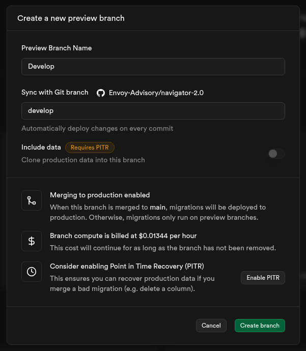
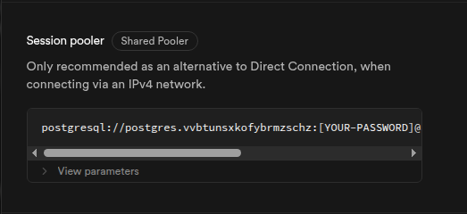

# Supabase Database Branch Management

## Problem Statement

The Supabase service needs to be maintained in regards to the Develop branch, as this is currently getting deleted every time we have a Git PR merged from develop git branch to main git branch.

## Solution

We need to perform the following steps to create a develop branch manually in the Supabase UI.

## Step 1: Create Branch

Select the "Create Branch" button from the branches drop-down menu.

## Step 2: Configure Branch

Create develop branch by providing "Develop" as the name and selecting "develop" for the Git branch.

## Step 3: Get Connection String

Locate the connection string of the newly created database by pressing the "Connect" button and looking over the connection section.

## Additional Notes

- Make sure to update your environment variables with the new connection string
- Test the connection before deploying to production
- Consider setting up automated branch creation for future releases