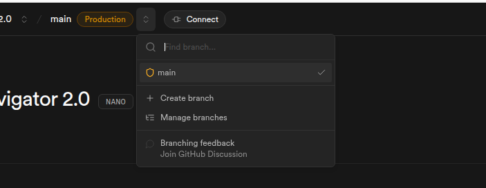

# Supabase Database Branch Management

## Problem Statement

The Supabase service needs to be maintained in regards to the Develop branch, as this is currently getting deleted every time we have a Git PR merged from develop git branch to main git branch.

## Solution

We need to perform the following steps to create a develop branch manually in the Supabase UI.

## Step 1: Create Branch

Select the "Create Branch" button from the branches drop-down menu.

## Step 2: Configure Branch

Create develop branch by providing "Develop" as the name and selecting "develop" for the Git branch.

## Step 3: Get Connection String

Locate the connection string of the newly created database by pressing the "Connect" button and looking over the connection section.

## Step 4: Set password

Set the password of the newly introduced branch in the Supabase UI by navigating to left menu "Project Settings" and selecting the "Database" in the configuration section.

From there, you can set the password in the "Database Password" section by pressing on the "Reset database password" button.

In that pop-up window you enter the preferred password (recommended to generate a new strong password by the system), copy it in your clipboard and press the "Reset password" button.

# Supabase Database Integration with the app

## Problem Statement

The postgreSQL DB needs to be initiated with the app's schema and the app needs to be configured accordingly 
in order to get connected with newly introduced db.

## Step 1: Update environment variable

After locating the connection string and setting the preferred password in the Supabase UI, you would need to set accordingly the DATABASE_URL variable in the ./server/.env.dev file of the app.

## Step 2: Create the new PostgreSQL db in the Supabase branch.

Having established the db connection in the DEV environment, you would need to run the following script that will create the DB in Supabase service.

./scripts/setup-dev.sh

The end of the logs by running this script should look like something as follows:

## Step 3: Validate the DB creation 

As long as the script has been run successfully, you should be in a position to observe the newly created tables based on the app's defined schema (./server/prisma/schema.prisma) in Supabase.

To do so, you could go to the "Schema Visualizer" section and observe the DB schema, with the tables and their defined relationships.

## Problem Statement

After initializing the DB, the app can be functional but the Admin page is not visible.

## Solution

We need to perform the following steps to enable a user to access the admin page.

## Step 1: Edit the 'users' table

As long as a new user has been created from the registration form, there will be a corresponding entry in the 'users' table with the role 'employer', as this is the default role in the app.
From there, the app's developer (that has edit access in the Supabase service) can edit this entry with the value 'admin' for the propsective admin user of the app.

## Step 2: Logout and Re-Login

After the edit in the DB table has been performed, the prospective user would need to logout and re-login once.
Once this happens, he/she will be able to see the "Admin" button from where he/she can navigate in the Admin panel of the app.

## Additional Notes

- Consider setting up automated branch creation for future releases